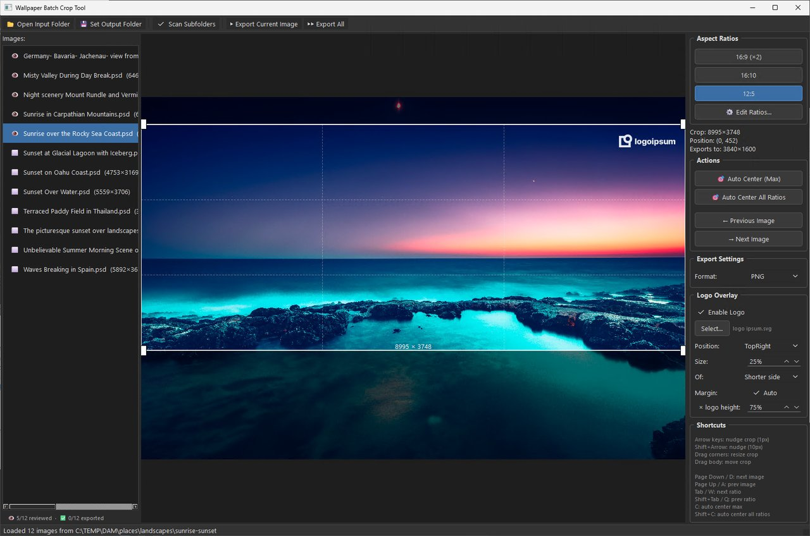
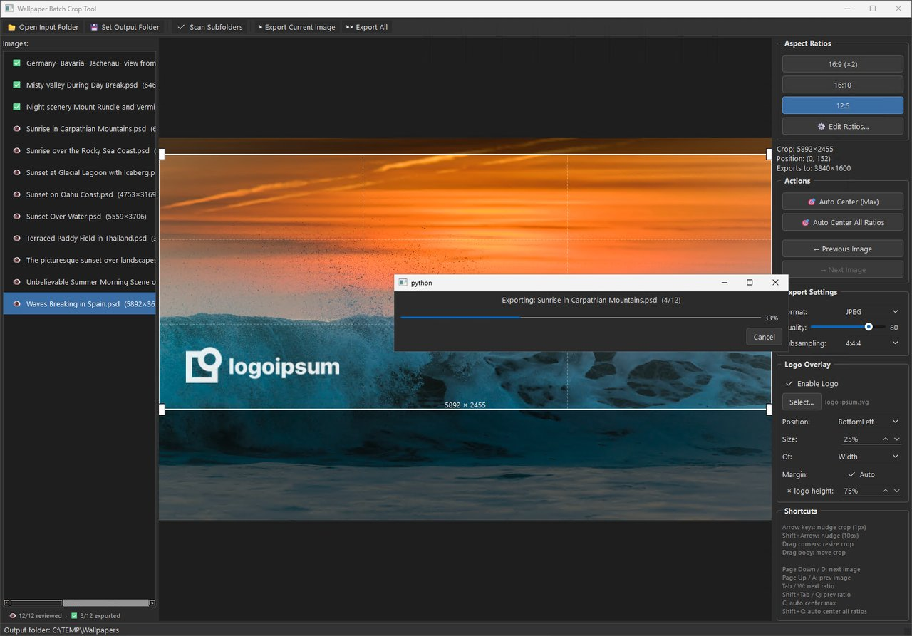
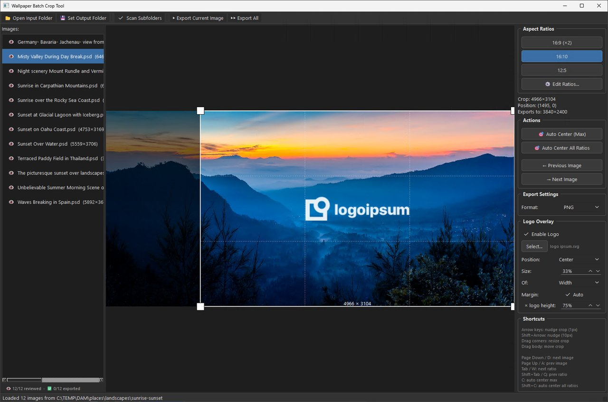
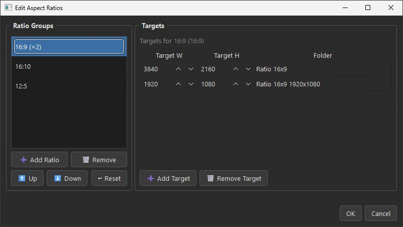

# Wallpaper Batch Crop Tool

A desktop application for batch cropping and resizing high-resolution wallpapers to multiple screen aspect ratios with interactive crop positioning.


[](LICENSE)

## The Problem

You have a collection of high-resolution wallpapers (PSD, PNG, JPEG, etc.) and need them in multiple screen ratios — 16:9, 16:10, ultrawide — each saved at a specific resolution. Doing this manually in Photoshop means opening each file, cropping three times, resizing, and exporting. For large collections, this takes forever.

## The Solution

This tool lets you:

1. Load an entire folder (with subfolder scanning)
2. Visually position the crop for each aspect ratio per image
3. Export everything in parallel with a single click

The folder structure is preserved in the output, so your organized collection stays organized.

## Screenshots

### Interactive Crop Editor with Logo Overlay
Adjust crop position and size for each aspect ratio. The logo overlay preview (TopRight, 25%) shows exactly what the export will look like.



### Batch Export Progress
Parallel export with progress tracking — processes multiple images simultaneously across CPU cores. The ✅ icons confirm which images have been exported.



### Logo Overlay — Center Position
The logo overlay supports multiple positions and sizes. Here the logo is centered at 50% of the shorter side.



### Ratio Editor
Two-panel layout: ratio groups on the left, export targets on the right. Add ratios, add targets per ratio, reorder groups, and reset to defaults — duplicate aspect ratios are automatically detected.



### JPEG Export with Logo Overlay
Export as JPEG with configurable quality and chroma subsampling. The logo overlay (BottomLeft, 25%) is composited at full export resolution.


## Features

- **Interactive crop editor** — drag to reposition, drag corners to resize (aspect ratio locked)
- **Multiple aspect ratios** — switch between ratios per image, each remembers its own crop position
- **Ratio grouping** — one crop per aspect ratio, shared across multiple export resolutions (e.g. crop 16:9 once, export at both 4K and 1080p)
- **Two-panel ratio editor** — add ratio groups and export targets from a built-in GUI (⚙️ button), with duplicate aspect-ratio detection and live validation
- **Logo overlay** — optionally composite an SVG or PNG logo onto exports with configurable position, size, and margin, with live preview
- **Rule-of-thirds overlay** — helps with composition
- **PSD support** — reads Photoshop files directly via `psd-tools`, flattens layers automatically
- **Subfolder scanning** — recursively scans input folders and recreates the structure in output
- **Parallel export** — batch processing uses multiple CPU cores
- **Export format choice** — PNG (lossless, max compression) or JPEG (tunable quality, 4:4:4 subsampling, Huffman optimization)
- **Progress tracking** — reviewed/exported counters, progress dialogs for all operations
- **Keyboard-driven workflow** — navigate images and ratios without touching the mouse
- **Large image support** — handles images exceeding Pillow's default 178MP limit
- **Duplicate protection** — automatically appends `-01`, `-02` if filenames collide
- **Crop memory** — crop positions persist across restarts; images are identified by content fingerprint so renames and moves don't lose your work

## Keyboard Shortcuts

| Action                  | Keys                    |
| ----------------------- | ----------------------- |
| Next image              | `Page Down` / `D`       |
| Previous image          | `Page Up` / `A`         |
| Next ratio              | `Tab` / `W`             |
| Previous ratio          | `Shift+Tab` / `Q`       |
| Auto center max         | `C`                     |
| Auto center all ratios  | `Shift+C`               |
| Nudge crop (1px)        | `Arrow keys`            |
| Nudge crop (10px)       | `Shift+Arrow keys`      |

## Installation

### Prerequisites

- Python 3.10 or higher

### Install dependencies

```bash
pip install -r requirements.txt
```

For SVG logo support, ensure [ImageMagick](https://imagemagick.org/) is installed and `magick` is on your PATH.

### Run

```bash
python -m wallpaper_crop_tool
```

## Usage

### Basic Workflow

1. Click **📂 Open Input Folder** and select your wallpaper directory
2. Click **💾 Set Output Folder** to choose where exports go
3. Browse through images — each starts with an auto-centered maximum crop
4. Adjust crops as needed: drag the crop rectangle or use corner handles to resize
5. Use `W`/`Q` to cycle through ratios, `D`/`A` to move between images
6. When done reviewing, click **▶▶ Export All**

### Quick Batch (No Manual Review)

If you just want auto-centered crops for everything:

1. Open input folder
2. Set output folder
3. Click **▶▶ Export All** — all images export with centered maximum crops

### Logo Overlay (Optional)

Add a logo or watermark to all exported wallpapers:

1. In the **Logo Overlay** panel (right side), click **Select…** to choose an SVG or PNG logo
2. Adjust **Position** (TopRight, BottomLeft, Center, etc.)
3. Set **Size** as a percentage of the image width/height/shorter side
4. Set **Margin** in pixels from the edge
5. The logo appears live on the preview — what you see is what you get
6. Toggle the **Enable Logo** checkbox to compare with/without

The logo is applied during export to the final resolution image, so it stays sharp regardless of preview zoom.

> **SVG logos** require [ImageMagick](https://imagemagick.org/) (`magick` on PATH) — uses exact-density vector rasterization for sharp edges.
> **PNG logos** work out of the box with no extra dependencies.

### Progress Tracking

Images in the list show their status:
- ⬜ Not yet viewed
- 👁 Reviewed (you've looked at it)
- ✅ Exported

A counter below the image list shows overall progress: `👁 12/45 reviewed · ✅ 8/45 exported`

## Output Structure

With subfolder scanning enabled, the output mirrors your input structure. Each export target gets its own folder:

```
Output/
├── Ratio 16x9 4K/
│   ├── places/landscapes/beaches/
│   │   └── wallpaper.png    (3840×2160)
│   └── places/landscapes/mountains/
│       └── wallpaper.png    (3840×2160)
├── Ratio 16x9 FHD/
│   ├── places/landscapes/beaches/
│   │   └── wallpaper.png    (1920×1080)
│   └── ...
├── Ratio 16x10/
│   └── ...
├── Ratio 12x5/
│   └── ...
```

When a ratio group has multiple targets (e.g. 16:9 at both 4K and 1080p), both outputs share the same crop position — you position the crop once and get every resolution.

## Configuration

### Ratio Configuration

Ratios are stored in a JSON file in your user config directory and can be edited from the app:

1. Click the **⚙️ Edit Ratios…** button in the Aspect Ratios panel
2. **Left panel — Ratio groups**: add, remove, and reorder aspect ratio groups
3. **Right panel — Targets**: add and remove export resolutions for the selected group
4. **Add a ratio**: enter an aspect ratio (e.g. `21:9`) and a target width — the height is auto-computed. Duplicate aspect ratios are blocked (e.g. `42:18` when `21:9` already exists)
5. **Add a target**: enter a target width for an existing ratio group — useful for exporting the same crop at multiple resolutions
6. Click **OK** to save — ratio buttons update immediately, no restart needed

Existing crop positions are preserved for unchanged aspect ratios. New ratios get auto-centered maximum crops.

The config file is located at:

| Platform | Path |
| -------- | ---- |
| Windows  | `%APPDATA%\wallpaper-crop-tool\ratios.json` |
| macOS    | `~/Library/Application Support/wallpaper-crop-tool/ratios.json` |
| Linux    | `~/.config/wallpaper-crop-tool/ratios.json` |

On first launch the file is created automatically with the built-in defaults (16:9, 16:10, 12:5). If the file is missing or corrupted, the defaults are restored.

You can also edit `ratios.json` directly. It uses a versioned envelope with nested ratio groups:

```json
{
  "version": 1,
  "ratios": [
    {
      "name": "16:9",
      "ratio_w": 16,
      "ratio_h": 9,
      "targets": [
        { "target_w": 3840, "target_h": 2160, "folder": "Ratio 16x9 4K" },
        { "target_w": 1920, "target_h": 1080, "folder": "Ratio 16x9 FHD" }
      ]
    }
  ]
}
```

Each ratio group has a `targets` array containing one or more export resolutions. All targets in a group share the same crop position.

### Crop Cache

Crop positions are saved automatically to `crop_cache.json` in the same config directory. When you rescan a folder (or scan a different folder containing the same images), previously set crop positions are restored automatically.

Images are identified by a content fingerprint (SHA-256 of the first 64 KB + file size), so renaming or moving files does not lose your saved crops. If an image is replaced with a different file at the same path, the stale cache entry is ignored and the crop defaults to auto-center.

The cache file is managed automatically — no user action is required. If deleted, the app simply starts fresh with auto-centered crops for all images.

### Other Settings

These constants are in `wallpaper_crop_tool/config.py`:

| Setting              | Default | Description                                        |
| -------------------- | ------- | -------------------------------------------------- |
| `PNG_COMPRESS_LEVEL` | `9`     | PNG compression (0-9, 9 = max compression)         |
| `JPEG_QUALITY_DEFAULT` | `95`  | JPEG quality (1-100)                               |
| `JPEG_SUBSAMPLING_DEFAULT` | `4:4:4` | Chroma subsampling (4:4:4 / 4:2:2 / 4:2:0)  |
| `IMAGE_EXTENSIONS`   | —       | Set of supported file extensions                   |
| `NUDGE_SMALL`        | `1`     | Arrow key nudge in pixels                          |
| `NUDGE_LARGE`        | `10`    | Shift+Arrow nudge in pixels                        |
| `MIN_CROP_SIZE`      | `50`    | Minimum crop dimension in pixels                   |

## Supported Formats

**Input:** PNG, JPEG, BMP, TIFF, WebP, PSD (Photoshop)

**Output:** PNG (maximum compression) or JPEG (configurable quality, subsampling, Huffman optimization)

## License

[MIT](LICENSE)
